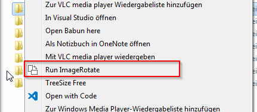

# Image Rotate tool

This application will rotate all your images in the given directory. So you do not need that anymore by hand.
If the image do not support `EXIF` information this tool will not be able to rotate these files, so it will leave it like they are.

Also it is able to run this application as a console application via the command line. You need only to pass the path to the directory as a parameter.
> If you path contains white spaces then you need to set the path between **"** *path* **"**

## Setup
Read me to add **image rotater** to the context menu (manually)

### Automatically setup

There is a powershell script which you can use to set the regestry entry (you may have to executed it as admin) script is stored `Setup\Install.ps1`. If you do not longer want to have this entry in your regestry you can remove it by using the `Setup\Remove.ps1` script.

- [Install script](.\Setup\Install.ps1)
- [Remove script](.\Setup\Remove.ps1)

### Manual setup

1. Start the regedit.exe
> Open start and type "regedit.exe and start this application 
2. Navigate to "HKEY_CLASSES_ROOT\directory\shell"
3. Add there a new "KEY" with you custome name. For example "RotationTool" 
> Optional: Change name in this automaticlly created default entry (will chnage the display name)
4. Add a second value with the name **icon** and add as value the path to the icon of the executable (then the icon will displayed in the context menu)
5. Click right click to this "KEY" and create a second one with the name **command** add to this "Default" entry the path of the Image Rotater executable.  
